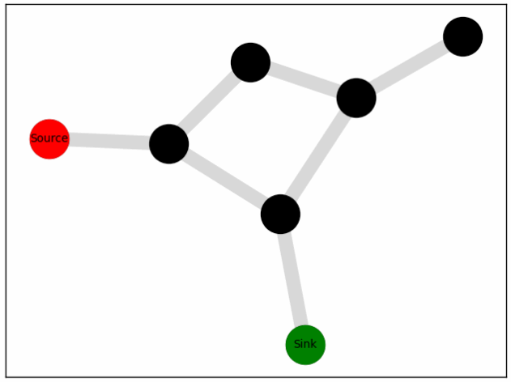
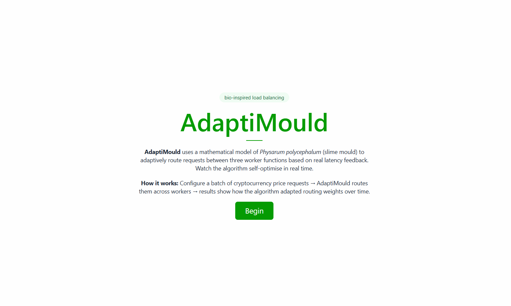

# AdaptiMould

_Bio-inspired adaptive load balancing on Google Cloud Platform_

[](https://github.com/aichinweze/slime-mould-model/actions/workflows/ci.yml)

AdaptiMould uses a mathematical model of _Physarum polycephalum_ (Slime Mould) to
adaptively route requests between three Cloud Run Functions based on real latency feedback. Edge conductivity — the routing weight assigned to each worker —
evolves over time, favouring faster workers and starving slower ones, without any manual configuration.

---

## ⚙️ How It Works

_Physarum polycephalum_ is a single-celled organism that builds efficient transport
networks by reinforcing paths that carry more flow and letting underused paths decay.
AdaptiMould applies the same principle to request routing.

Each worker is represented as an edge in a weighted graph connecting a source node
to a sink node. At each iteration:

1. Pressure is propagated across the graph using the current conductivity matrix
2. Conductivity on each edge is updated based on the flux it carries — edges that
   carry more traffic grow stronger, others decay
3. An efficiency matrix derived from real worker latency biases the update, so
   faster workers receive proportionally more traffic over time

The result is a routing system that continuously self-optimises without a
central controller.

**Prototype — edge weights converging on the most efficient source-to-sink path:**



**System architecture - Adaptimould pipeline flow**


A user configures a batch of cryptocurrency conversion requests via the UI, which are published to a Pub/Sub input topic. The backend then triggers a series of Flow Control cycles — each cycle routes conversion requests across three workers, with routing probability weighted by edge conductivity. Workers call the Coinbase API and publish results to success or error topics. The Metrics Processor consumes success messages and updates rolling latency metrics in Firestore, which Flow Control reads on the next cycle to update conductivity. Once all cycles complete, the UI retrieves and displays the results as a series of charts (see demo).

---

## 🛠️ Tech stack

| Layer          | Technology                                   |
| -------------- | -------------------------------------------- |
| Frontend       | React 19, TypeScript, Tailwind CSS, Recharts |
| Backend        | FastAPI, Python 3.13                         |
| Messaging      | Google Cloud Pub/Sub                         |
| State          | Google Cloud Firestore                       |
| Compute        | Google Cloud Run Functions                   |
| Infrastructure | Google Cloud Build                           |
| Testing        | pytest, unittest                             |
| CI             | GitHub Actions                               |

---

## 📸 Demo



The demo shows a user configuring a batch, previewing the generated messages, and
viewing the results across three charts:

1. **Route Weight Evolution** — Conductivity per worker edge across iterations.
   Higher conductivity means more traffic routed to that worker. Worker A maintains
   the highest route weight throughout, consistent with its lower latency.
2. **Rolling Latency per Worker** — The primary signal driving conductivity updates.
   Lower latency on an edge increases its conductivity on the next cycle.
3. **Messages Processed per Worker** — Total successful (green) and failed (red)
   messages per worker, showing clear traffic bias toward the fastest workers.

---

## 🎯 MVP Design Decisions & Scope

The following decisions were made deliberately to keep the MVP focused:

| Decision                                   | Rationale                                                                                                               |
| ------------------------------------------ | ----------------------------------------------------------------------------------------------------------------------- |
| **Discrete-time control loop**             | Conductivity updates on a fixed interval, simplifying reasoning and debugging while mirroring iterative Physarum models |
| **Direct routing (no buffer)**             | Router sends requests directly to workers asynchronously, reducing system complexity                                    |
| **Sliding window metrics aggregation**     | Uses recent observations rather than full history, balancing responsiveness against stability                           |
| **Firestore for state**                    | Chosen over Bigtable for simplicity and low-latency reads/writes, appropriate for small-scale adaptive state            |
| **Failures excluded from learning signal** | External API failures are not modelled in conductivity updates, avoiding noise from uncontrollable factors              |

---

## 🚀 Local setup

### Prerequisites

- Python 3.13
- Node.js 20+
- [uv](https://docs.astral.sh/uv/)
- [Firebase CLI](https://firebase.google.com/docs/cli) (for emulators)
- A GCP project with Pub/Sub, Firestore, and Cloud Run Functions enabled

### 1. Emulators

Start the Firestore and Pub/Sub emulators:

```bash
firebase emulators:start
```

```bash
gcloud beta emulators pubsub start --project=testing-project-id --host-port=localhost:8085
```

The emulator UI is available at `http://localhost:4040`.

### 2. Backend

```bash
# Install dependencies
uv sync --group dev

# Copy and fill in environment variables
cp ui/backend/.env.example ui/backend/.env

# Start the FastAPI server
uv run uvicorn ui.backend.main:app --reload --port 8000
```

The backend proxies requests to GCP, so a real GCP project is required even
for local development. Set `FLOW_CONTROL_URL` in `.env` to your deployed
Flow Control function URL.

### 3. Frontend

```bash
cd ui/frontend
npm install
npm run dev
```

The frontend is available at `http://localhost:5173` and proxies `/api`
requests to the backend at `http://localhost:8000`.

---

## ☁️ GCP deployment

### Service account setup

AdaptiMould uses four service accounts, each with the minimum permissions
required for its role.

#### 1. Flow Control (`adaptimould-service-account`)

```bash
gcloud iam service-accounts create adaptimould-service-account \
  --display-name="AdaptiMould Flow Control"

for role in \
  roles/datastore.user \
  roles/cloudfunctions.developer \
  roles/cloudfunctions.invoker \
  roles/logging.logWriter \
  roles/pubsub.publisher \
  roles/pubsub.subscriber \
  roles/iam.serviceAccountTokenCreator \
  roles/iam.serviceAccountUser; do
  gcloud projects add-iam-policy-binding your-project-id \
    --member="serviceAccount:adaptimould-service-account@your-project-id.iam.gserviceaccount.com" \
    --role="$role"
done
```

#### 2. Metrics Processor (`adaptimould-metrics-account`)

```bash
gcloud iam service-accounts create adaptimould-metrics-account \
  --display-name="AdaptiMould Metrics Processor"

for role in \
  roles/datastore.user \
  roles/cloudfunctions.developer \
  roles/cloudfunctions.invoker \
  roles/logging.logWriter \
  roles/pubsub.subscriber \
  roles/iam.serviceAccountUser; do
  gcloud projects add-iam-policy-binding your-project-id \
    --member="serviceAccount:adaptimould-metrics-account@your-project-id.iam.gserviceaccount.com" \
    --role="$role"
done
```

#### 3. Workers (`adaptimould-worker-account`)

```bash
gcloud iam service-accounts create adaptimould-worker-account \
  --display-name="AdaptiMould Workers"

for role in \
  roles/cloudfunctions.developer \
  roles/cloudfunctions.invoker \
  roles/logging.logWriter \
  roles/pubsub.publisher \
  roles/iam.serviceAccountTokenCreator \
  roles/iam.serviceAccountUser; do
  gcloud projects add-iam-policy-binding your-project-id \
    --member="serviceAccount:adaptimould-worker-account@your-project-id.iam.gserviceaccount.com" \
    --role="$role"
done
```

#### 4. Cloud Build

```bash
for role in \
  roles/artifactregistry.writer \
  roles/cloudbuild.builds.builder \
  roles/cloudfunctions.developer \
  roles/run.admin \
  roles/logging.logWriter \
  roles/iam.serviceAccountUser \
  roles/storage.admin; do
  gcloud projects add-iam-policy-binding your-project-id \
    --member="serviceAccount:your-project-number@cloudbuild.gserviceaccount.com" \
    --role="$role"
done
```

Replace `your-project-number` with your numeric GCP project number:

```bash
gcloud projects describe your-project-id --format="value(projectNumber)"
```

---

### Manual deployment

Each Cloud Run Function has its own `cloudbuild.yaml`. To deploy:

```bash
gcloud builds submit --config=flow_control/cloudbuild.yaml \
  --substitutions=_PROJECT_ID=your-project-id,_REGION=us-central1
```

Repeat for `metrics_processor/`, `worker_a/`, `worker_b/`, and `worker_c/`.

Update the `your-project-id` substitution default in each `cloudbuild.yaml`
before deploying.

---

### Optional: Automated deployment via Cloud Build triggers

You can configure GCP to automatically deploy each function whenever a new commit is pushed/merged into `master`. Run the following for each function, replacing the `--build-config` path and trigger name as appropriate:

```bash
gcloud builds triggers create github \
  --name=deploy-flow-control \
  --repo-name=your-repo-name \
  --repo-owner=your-github-username \
  --branch-pattern=^master$ \
  --build-config=flow_control/cloudbuild.yaml \
  --substitutions=_PROJECT_ID=your-project-id,_REGION=us-central1
```

Repeat for each function, changing `--name` and `--build-config`:

| Trigger name               | Build config                        |
| -------------------------- | ----------------------------------- |
| `deploy-flow-control`      | `flow_control/cloudbuild.yaml`      |
| `deploy-metrics-processor` | `metrics_processor/cloudbuild.yaml` |
| `deploy-worker-a`          | `worker_a/cloudbuild.yaml`          |
| `deploy-worker-b`          | `worker_b/cloudbuild.yaml`          |
| `deploy-worker-c`          | `worker_c/cloudbuild.yaml`          |

---

## 🧪 Running tests

```bash
uv run pytest tests/ -v
```

---

## 📂 Project structure

```
├── slime_mould/          # Core algorithm — graph, model, update functions
├── models/               # Shared data models (CryptoResult, Metrics, etc.)
├── utils/                # Firestore and Flow control utilities
├── flow_control/         # Flow Control Cloud Run Function
├── metrics_processor/    # Metrics Processor Cloud Run Function
├── worker_a/             # Worker A — low latency
├── worker_b/             # Worker B — high latency (aggregates multiple calls)
├── worker_c/             # Worker C — medium latency (delay)
├── workers/              # Shared worker base class
├── ui/
│   ├── frontend/         # React/TypeScript UI
│   └── backend/          # FastAPI backend
└── tests/                # pytest/unittest test suite
```

---

## 🔭 Future work

### System design

- Introduce Pub/Sub between the router and workers for decoupling and buffering
- Move to an event-driven control loop instead of a fixed-schedule discrete update
- Add dead-letter topic handling and retry-aware learning signal

### Modelling improvements

- Incorporate throughput, success rate and cost as additional routing signals
- Replace sliding window aggregation with exponential moving average for smoother adaptation
- Add multi-source / multi-sink routing scenarios to model more complex network topologies

### Scalability

- Migrate metrics storage to BigQuery for historical analysis and longer retention
- Introduce sharded or larger graph topologies to support higher worker counts

### Observability

- Add monitoring dashboards showing latency vs conductivity over time
- Visualise the evolving network topology as conductivity shifts between workers

---

## 👤 Author

**aichinweze**  
[GitHub](https://github.com/aichinweze) // [LinkedIn](https://www.linkedin.com/in/ifeanyi-chinweze-673b0916b/)

---

## License

MIT License

Copyright (c) 2026 aichinweze

Permission is hereby granted, free of charge, to any person obtaining a copy
of this software and associated documentation files (the "Software"), to deal
in the Software without restriction, including without limitation the rights
to use, copy, modify, merge, publish, distribute, sublicense, and/or sell
copies of the Software, and to permit persons to whom the Software is
furnished to do so, subject to the following conditions:

The above copyright notice and this permission notice shall be included in all
copies or substantial portions of the Software.

THE SOFTWARE IS PROVIDED "AS IS", WITHOUT WARRANTY OF ANY KIND, EXPRESS OR
IMPLIED, INCLUDING BUT NOT LIMITED TO THE WARRANTIES OF MERCHANTABILITY,
FITNESS FOR A PARTICULAR PURPOSE AND NONINFRINGEMENT. IN NO EVENT SHALL THE
AUTHORS OR COPYRIGHT HOLDERS BE LIABLE FOR ANY CLAIM, DAMAGES OR OTHER
LIABILITY, WHETHER IN AN ACTION OF CONTRACT, TORT OR OTHERWISE, ARISING FROM,
OUT OF OR IN CONNECTION WITH THE SOFTWARE OR THE USE OR OTHER DEALINGS IN THE
SOFTWARE.
